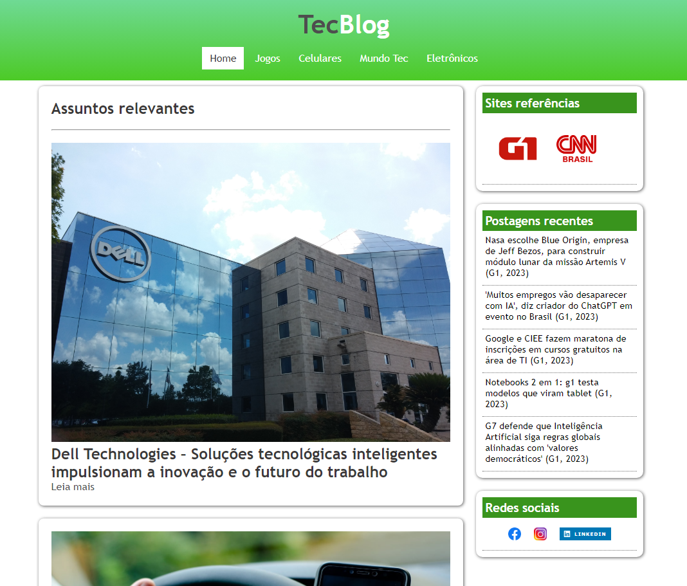

<h1 align="center"> Projeto Site Tecnológico </h1>

Site desenvolvido com base no curso de desenvolvimento web completo pela Udemy.  

  

 

  

## 🚀 Tecnologias

Esse projeto foi desenvolvido com as seguintes tecnologias:

- HTML e CSS
- Github

## 💻 Projeto

É basicamente a simulação de um site real com informações e notícias do mundo tecnológico.

Possui notícias embasadas de outros sites, com todos os direitos reservados aos mesmos.

As navegações por todas as seções do menu superior, estão devidamente ativas e preenchidas com as informações do menu escolhido.

- [Acesse o projeto finalizado, online](https://paullods.github.io/site-tec/Projeto3/)

## :memo: Licença

Esse projeto está sob a licença MIT.

---

Feito com ♥
